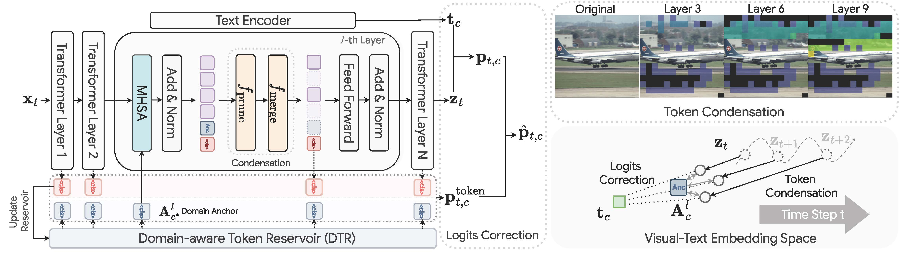
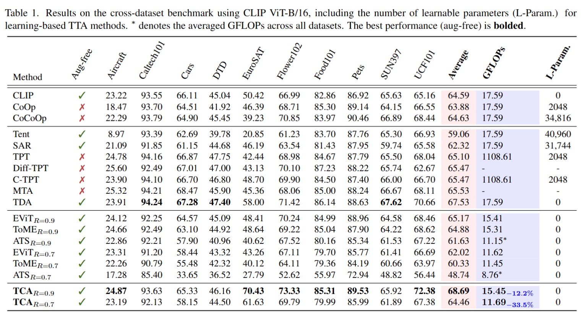

# Is Less More? Exploring Token Condensation as Training-free Test-time Adaptation

## 📰 News

🎉 Our paper **"Is Less More? Exploring Token Condensation as Training-free Test-time Adaptation"** has been accepted at **ICCV 2025**!  
This work explores efficient online test-time adaptation for real-world distribution shifts, focusing on robustness without retraining.  

📍 Conference: [ICCV 2025](https://iccv.thecvf.com/virtual/2025/poster/1260)  
📄 Paper: [Arxiv version](https://arxiv.org/abs/2410.14729)  

---

## Overview

This repository contains the official implementation of our token condensation method for Vision Transformers with Test-Time Adaptation (TCA). Our approach demonstrates that intelligent token pruning combined with adaptive classification can improve both efficiency and performance during test-time adaptation to distribution shifts.



We explore whether reducing the number of visual tokens processed by Vision Transformers can improve efficiency without sacrificing performance. We implement and compare three token pruning strategies:

- **EViT**: Efficient Vision Transformer that drops tokens based on attention scores
- **ToME**: Token Merging that combines similar tokens
- **Ours**: Our novel token condensation approach using coreset averaging and hierarchical token selection

Our method is evaluated on CLIP (Contrastive Language-Image Pre-training) models across multiple datasets with test-time adaptation.

## Key Features

- 🚀 **Efficient Token Condensation**: Reduces computational cost by processing fewer tokens
- 🎯 **Training-free Test-Time Adaptation**: Adapts to test distributions using reservoir-based caching without retraining
- 📊 **Comprehensive Evaluation**: Tested on 15+ datasets including ImageNet variants
- 🔧 **Flexible Framework**: Easy to extend with new pruning methods
- 🌟 **Real-world Robustness**: Focuses on practical distribution shifts

## Environment Setup

### Prerequisites

- Python 3.9+
- CUDA-compatible GPU (recommended)
- Anaconda or Miniconda

### Installation

1. **Clone the repository:**
```bash
git clone https://github.com/Jo-wang/TCA.git
cd TCA
```

2. **Create conda environment:**
```bash
conda env create -f environment.yaml
conda activate TTA
```

## Dataset Preparation

### Supported Datasets

The framework supports the following datasets:

**ImageNet Variants:**
- ImageNet (I)
- ImageNet-A (A) - Natural adversarial examples
- ImageNet-V (V) - ImageNetV2 matched frequency
- ImageNet-R (R) - Rendition
- ImageNet-S (S) - Sketch

**Fine-grained Classification:**
- Caltech101
- DTD (Describable Textures Dataset)
- EuroSAT
- FGVC (Fine-Grained Visual Classification)
- Food101
- Oxford Flowers
- Oxford Pets
- Stanford Cars
- SUN397
- UCF101

### Data Structure

Based on the project's codebase, organize your datasets as follows:
```
data/
├── imagenet/
│   └── val/                 # ImageNet validation images
├── imagenet-a/              # ImageNet-A (natural adversarial examples)
├── imagenet-r/              # ImageNet-R (rendition)
├── imagenet-s/
│   └── sketch/              # ImageNet-Sketch
├── caltech101/
│   └── 101_ObjectCategories/# Caltech101 images
├── dtd/
│   └── images/              # Describable Textures Dataset
├── eurosat/                 # EuroSAT satellite images
├── fgvc/
│   └── data/
│       └── images/          # FGVC Aircraft images
├── food-101/
│   └── images/              # Food-101 images
├── oxford_flowers/          # Oxford Flowers images
├── oxford_pets/
│   ├── images/              # Oxford Pets images
│   └── annotations/         # Oxford Pets annotations
├── sun397/
│   └── SUN397/              # SUN397 images
└── ucf101/                  # UCF101 action recognition
```

### Download Instructions

For detailed dataset preparation instructions, please refer to [CoOp's data preparation guide](https://github.com/KaiyangZhou/CoOp/blob/main/DATASETS.md).

## Usage

### Basic Usage

Run the token pruning experiment with our method:

```bash
python runner.py 
```


### Command Line Arguments

| Argument | Description | Default |
|----------|-------------|---------|
| `--config` | Path to configuration directory | `configs/` |
| `--datasets` | Datasets to process | `oxford_flowers` |
| `--data-root` | Path to datasets directory | `data/` |
| `--backbone` | CLIP model backbone | `ViT-B/16` |
| `--token_pruning` | Pruning method and rate | `Ours-0.035` |
| `--wandb-log` | Enable Weights & Biases logging | `False` |
| `--reservoir-sim` | Use cosine similarity for caching | `True` |
| `--div` | Use diverse samples for caching | `True` |
| `--token_sim` | Use token-level similarity | `True` |
| `--flag` | Fuse similarity with current sample | `True` |


## Method Details

### Our Token Pruning Approach

Our method introduces several key innovations:

1. **Hierarchical Token Selection**: Instead of binary keep/drop decisions, we use multiple levels of token importance
2. **Coreset Averaging**: Groups similar tokens and represents them with fewer representative tokens
3. **Class Token Context**: Leverages previously seen examples to guide token selection
4. **Information Preservation**: Summarizes dropped tokens rather than discarding them completely

### Test-Time Adaptation

The TCA framework:
- Maintains a reservoir of representative samples per class
- Uses feature similarity to guide sample selection
- Dynamically updates predictions based on test distribution
- Combines CLIP predictions with reservoir-based adaptation

## Results



Our method achieves:
- **Efficiency**: Reduces token count by up to 90% in later transformer layers
- **Performance**: Maintains or improves accuracy compared to full token processing
- **Adaptability**: Better adaptation to test distributions through reservoir caching


## Citation

If you use this code in your research, please cite:

```bibtex
@article{wang2024less,
  title={Is Less More? Exploring Token Condensation as Training-free Test-time Adaptation},
  author={Wang, Zixin and Gong, Dong and Wang, Sen and Huang, Zi and Luo, Yadan},
  journal={arXiv preprint arXiv:2410.14729},
  year={2024}
}
```

## Acknowledgments

- [OpenAI CLIP](https://github.com/openai/CLIP) for the base model
- [EViT](https://github.com/youweiliang/evit) for efficient vision transformer implementation
- [ToME](https://github.com/facebookresearch/ToMe) for token merging techniques
- [TDA](https://github.com/kdiAAA/TDA) for test-time adaptation on CLIP

## Contact

For questions or issues, please open an issue on GitHub or contact [zixin.wang@uq.edu.au].
